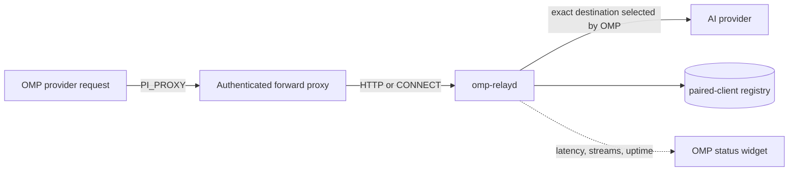

# omp-relay

[](https://github.com/DarkPhilosophy/omp-relay/actions/workflows/ci.yml)
[](https://www.npmjs.com/package/omp-relay)
[](https://github.com/DarkPhilosophy/omp-relay/releases)
[](https://www.gnu.org/licenses/gpl-3.0)

**omp-relay** is an authenticated, streaming forward relay for [OMP (Oh My Pi)](https://github.com/can1357/oh-my-pi). It routes provider traffic through a machine in another network without changing the provider destination selected by OMP.

Its primary use case is reaching AI providers that restrict clients by **GeoIP, region, ASN, or network policy**. It also works as a private reroute when one network path is unreliable.


## How it works



- **Exact destinations** — model requests, provider discovery, authentication, and streaming keep the effective URL selected by OMP.
- **Standard proxy protocol** — absolute-form HTTP requests and HTTPS `CONNECT` tunnels; no hard-coded model-to-host map.
- **Streaming transport** — incremental HTTP/SSE responses and WebSocket-compatible tunnelling.
- **Authenticated clients** — one-time pairing codes, random per-client credentials, server-side token hashing, and revocation.
- **Live OMP status** — connected, degraded, unreachable, and offline states with latency, stream count, and relay uptime.
- **Continuous health refresh** — the widget probes the relay periodically instead of showing stale state.

## Install

Install the OMP extension from npm:

```bash
omp plugin install omp-relay
```

npm installs do not update themselves — rerun `omp plugin install omp-relay` to pick up a newer release.

### Relay server binary

Download the archive for your Linux architecture from [GitHub Releases](https://github.com/DarkPhilosophy/omp-relay/releases):

| Architecture | Release asset |
| --- | --- |
| Linux x86-64 | `omp-relayd-linux-x86_64.tar.gz` |
| Linux ARM64 | `omp-relayd-linux-aarch64.tar.gz` |

Each archive has a matching `.sha256` checksum. The published executables are statically linked Linux binaries, so they do not depend on the build runner's glibc version.

Example installation:

```bash
tar -xzf omp-relayd-linux-x86_64.tar.gz
install -Dm755 omp-relayd ~/.local/bin/omp-relayd
```

### Checkout / development

```bash
git clone https://github.com/DarkPhilosophy/omp-relay.git
cd omp-relay
bun install
omp plugin link .
```

`omp plugin link .` registers the checkout and loads `src/index.ts`; no extension source is copied into OMP.

## Run the relay server

Keep the binary in a stable location. On Linux with systemd, the relay can install and manage its own user service:

```bash
install -Dm755 omp-relayd ~/.local/bin/omp-relayd

~/.local/bin/omp-relayd \
  --registry ~/.local/state/omp-relay/registry.json \
  service install --bind 10.90.0.2:43118

~/.local/bin/omp-relayd service status
```

The install command creates a hardened systemd user unit, reloads systemd, and enables the relay immediately. Use `service install --no-enable` to write the unit without starting it, or remove it later with:

```bash
~/.local/bin/omp-relayd service uninstall
```

On systems without systemd, run the process through your preferred supervisor:

```bash
omp-relayd \
  --registry ~/.local/state/omp-relay/registry.json \
  serve --bind 10.90.0.2:43118
```

Bind to a private WireGuard, NetBird, Tailscale, LAN, or similarly protected interface. Do not expose the relay directly to the public internet without an additional network-security layer.

## Pair and connect

Generate a single-use pairing code on the relay host:

```bash
omp-relayd --registry ~/.local/state/omp-relay/registry.json pair
```

Then pair and activate it inside OMP:

```text
/relay pair http://10.90.0.2:43118 CODE atv
/relay start atv
/relay status
```

## Commands

Type `/relay ` in OMP to open argument completion.

| Command | Purpose |
| --- | --- |
| `/relay pair <url> <code> [name]` | Pair this OMP client with a relay |
| `/relay list` | List paired relay servers |
| `/relay start [name]` | Route OMP provider traffic through the relay |
| `/relay stop` | Return to direct provider connections |
| `/relay status [name]` | Probe relay health and display latency |
| `/relay debug [on\|off]` | Toggle server-side routing diagnostics |

The extension stores pairing state under `~/.omp/agent/relay.json` with restrictive permissions. It never writes provider credentials into the relay registry.

## Status widget

The `belowEditor` widget presents the connection as a compact OMP-native status line:

```text
󰄬 RELAY CONNECTED  󰖟 atv  •  󰔟 364 ms  •  󰓅 0 streams  •  󱫑 7m 3s
```

- **Green** — relay reachable and authenticated.
- **Yellow** — reachable but degraded or reporting a problem.
- **Red** — configured relay is unreachable.
- **Offline** — rerouting is disabled.

A Nerd Font provides the full icon presentation; the accompanying text remains readable without those glyphs.

## Server administration

```bash
# List paired clients
omp-relayd --registry ~/.local/state/omp-relay/registry.json list

# Revoke one client immediately
omp-relayd --registry ~/.local/state/omp-relay/registry.json revoke UUID

# Run deterministic diagnostics without listening or touching the real registry
omp-relayd self-test
```

## Security model

1. **Private-network first.** The relay is a transport boundary, not a replacement for WireGuard, a firewall, or equivalent access control.
2. **Short-lived pairing.** Pairing codes expire after ten minutes, are case-insensitive, and can be consumed only once.
3. **Hashed credentials.** Client tokens are random and stored as hashes in the server registry.
4. **Authenticated proxying.** Every absolute-form request and `CONNECT` tunnel requires proxy authentication.
5. **Immediate revocation.** Revoking a client removes its authorization from the active registry.
6. **Safe diagnostics.** Debug logs contain routing metadata, not authorization headers or request bodies.
7. **Rate-limited pairing.** Failed pairing attempts are bounded by client IP.

## Release model

A stable version tag such as `v0.1.1` runs the release workflow:

1. scans locked npm dependencies for known vulnerabilities;
2. builds and self-tests static x86-64 and ARM64 Linux relay binaries;
3. validates the tag, npm version, and Cargo version;
4. runs formatting, type checks, Bun tests, Rust tests, Clippy, leak scan, package checks, and relay self-test;
5. installs the packed npm extension with OMP and runs `omp plugin doctor`;
6. publishes `omp-relay` to npm with provenance;
7. creates a GitHub Release containing both binary archives and their SHA-256 checksums.

CI artifacts are temporary build evidence only. User-facing binaries are attached directly to the GitHub Release.

## Repository layout

```text
src/index.ts          OMP extension: commands, proxy environment, health widget
relayd/src/forward.rs HTTP forward proxy and CONNECT tunnelling
relayd/src/registry.rs Pairing and client registry
tests/                Bun extension tests
.scripts/             Leak scan, package checks, and test-mode launcher
.github/workflows/    CI and stable-release automation
```

## Development

```bash
bun install
bun run verify       # full TypeScript + Rust verification and release build
bun run format       # apply Biome formatting
bun run test         # extension tests
bun run test:rust    # relay server tests
bun run test:mode    # deterministic relay self-test
bun run package:check
```

`test:mode` does not open a port, contact a provider, or modify the production registry.

## Support

If this helps your OMP workflow, sponsor continued development:

- GitHub Sponsors: <https://github.com/sponsors/DarkPhilosophy>

## License

[GPL-3.0-or-later](LICENSE).
